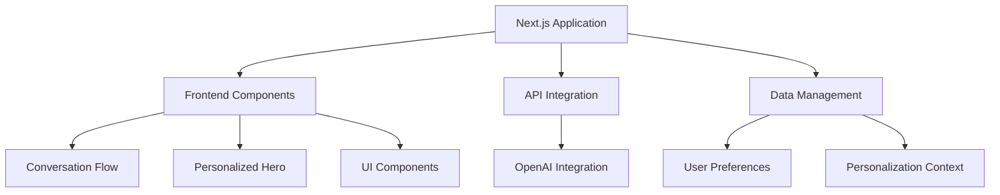
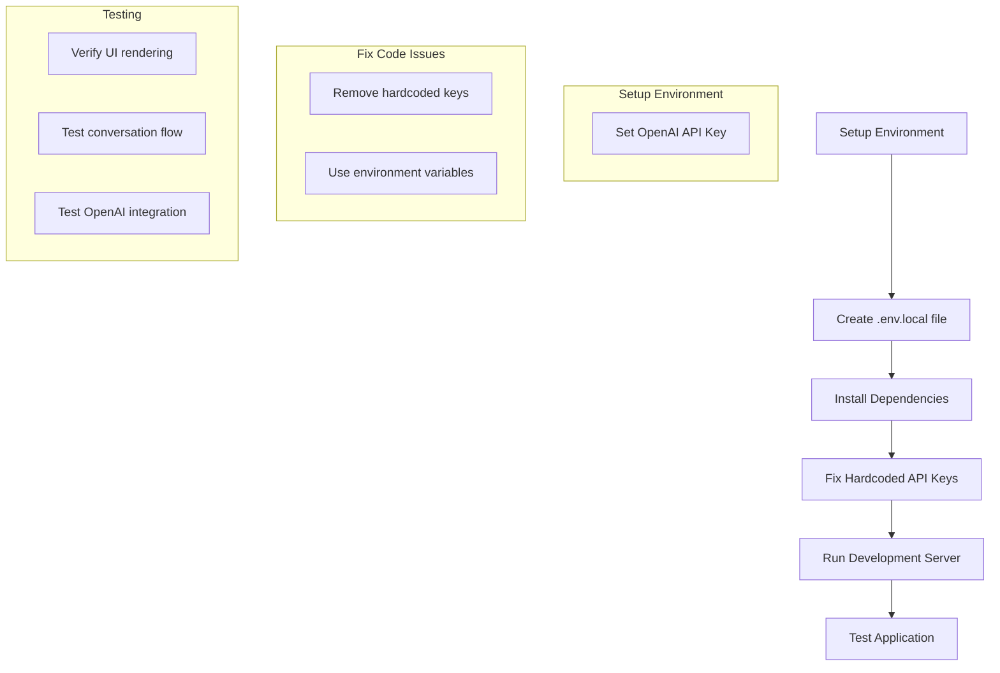

# Naible Application Setup Plan

## Overview

This document outlines the plan for getting the Naible application running locally. The application is a Next.js-based web application with TypeScript and TailwindCSS that provides a conversation-based personalization flow for a product called "Naible". The application uses OpenAI's API to generate personalized content based on user preferences.

## Current Application Structure



## Issues to Address

1. **Environment Variables**: The application has hardcoded OpenAI API keys in the code, which is a security concern.
2. **Dependencies**: Need to install all required dependencies.
3. **Development Server**: Need to set up and run the Next.js development server.
4. **Testing**: Verify that the application works correctly with the OpenAI integration.

## Implementation Plan



## Step-by-Step Implementation Plan

### 1. Setup Environment Variables

1. Create a `.env.local` file in the root directory with the following content:
   ```
   NEXT_PUBLIC_OPENAI_API_KEY=your_openai_api_key
   ```

### 2. Fix Hardcoded API Keys

1. Modify `src/hooks/useOpenAIConversation.ts` to remove the hardcoded API key and use only the environment variable:
   - Line 20: Replace with `apiKey: process.env.NEXT_PUBLIC_OPENAI_API_KEY,`
   - Line 173: Replace with `'Authorization': Bearer ${process.env.NEXT_PUBLIC_OPENAI_API_KEY}`

### 3. Install Dependencies

1. Run `npm install` to install all required dependencies from package.json.

### 4. Run Development Server

1. Run `npm run dev` to start the Next.js development server.
2. The application should be accessible at `http://localhost:3000`.

### 5. Test the Application

1. Open a web browser and navigate to `http://localhost:3000`.
2. Verify that the application loads correctly.
3. Test the conversation flow:
   - Accept privacy consent
   - Go through the introduction
   - Answer questions about color preferences, values, and goals
   - Verify that the personalized hero section is generated correctly

## Potential Issues and Solutions

1. **OpenAI API Key Issues**:
   - If the API key is invalid or expired, the application will fail to generate personalized content.
   - Solution: Ensure the API key is valid and has the necessary permissions.

2. **Dependency Conflicts**:
   - If there are version conflicts in the dependencies, the application may not build correctly.
   - Solution: If npm install fails, try using `npm install --legacy-peer-deps`.

3. **Port Conflicts**:
   - If port 3000 is already in use, the development server will fail to start.
   - Solution: Use `npm run dev -- -p 3001` to run on a different port.

4. **Environment Variable Access**:
   - Next.js requires environment variables to be prefixed with `NEXT_PUBLIC_` to be accessible in the browser.
   - Solution: Ensure the OpenAI API key environment variable is correctly prefixed.

## WSL Considerations

As per the global instructions, we'll use WSL for all local terminals when running in Windows:

1. Make sure WSL is installed and configured on your Windows system.
2. Navigate to the project directory in WSL.
3. Run all commands (npm install, npm run dev, etc.) within the WSL terminal.

## Next Steps

After confirming the application runs locally, we can:

1. Explore additional features and functionality.
2. Consider improvements to the code structure and organization.
3. Address any performance or accessibility issues.